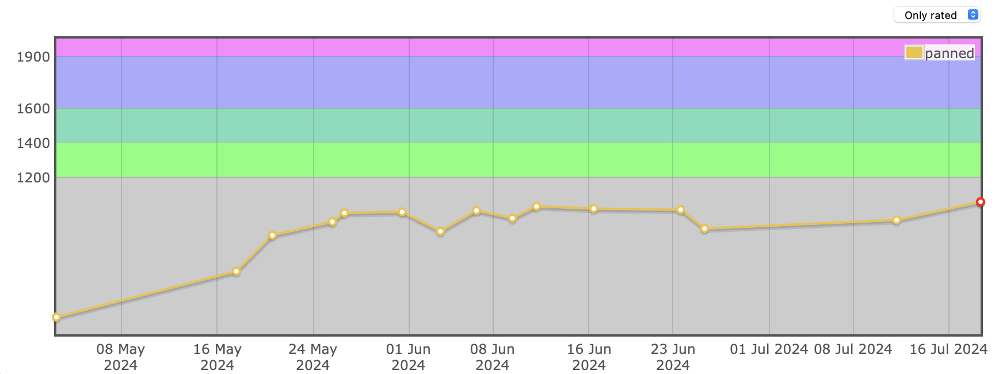

## Competitive Programming Practice

Welcome to my Competitive Programming repository! 
This repo contains my solutions to Codeforces problems.

*The contest folders have been named accurately and accordingly as those solved during the said contests, for exmaple: **[CodeforcesRound951Div2](/CodeforcesRound951Div2)**, while the problems solved out of contests will be included in other folders, for example: **[ProblemsetC++](/ProblemsetC++/)**, **[ProblemsetJava](/ProblemsetJava/)**, **[RandomCF](/RandomCF)**.*

## My Codeforces Profile

This is my profile: [panned](https://codeforces.com/profile/panned)

This is my ratings graph (I will try to keep it updated as much as possible, but visit [panned](https://codeforces.com/profile/panned) for a more up-to-date version.)

## Languages

All of my solutions are written in either of the following:
- *C++*
- *Java*

P.S. I started my Competitive Programming journey with Java and transitioned to C++ (est. 29 June 2024) along the way.